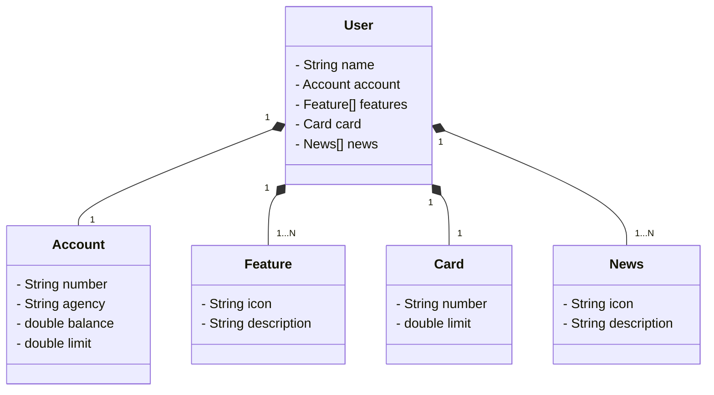

# Santander 2024 - Backend com Java

## Desafio de Projeto
### Publicando Sua API REST Na Nuvem Usando Spring Boot 3, Java 17 e Railway
&nbsp;
### Diagrama de Classes

```mermaid
classDiagram
    class User {
        - String name
        - Account account
        - Feature[] features
        - Card card
        - News[] news
    }
    
    class Account {
        - String number
        - String agency
        - double balance
        - double limit
    }
    
    class Feature {
        - String icon
        - String description
    }
    
    class Card {
        - String number
        - double limit
    }
    
    class News {
        - String icon
        - String description
    }
    
    User "1" *-- "1" Account
    User "1" *-- "1...N" Feature
    User "1" *-- "1" Card
    User "1" *-- "1...N" News
```
